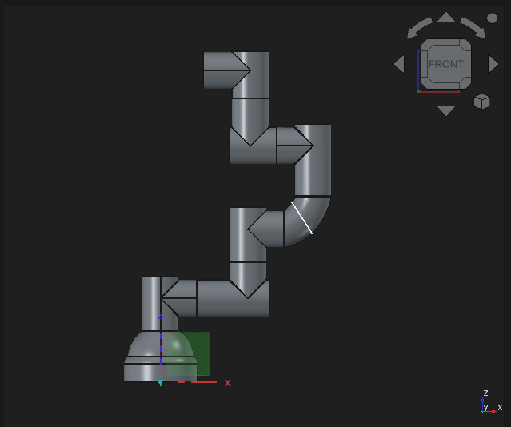

# 6-DOF Robotic Arm

A 6-DOF serial robotic manipulator designed from scratch for simulation, motion planning, control, and future hardware implementation.

<p align="center">
    
</p>

## Repository Structure

```text
src/
├── arm_description/
├── arm_moveit_config/
├── arm_ros2_control/
├── arm_gazebo/
└── arm_bringup/

CAD/
docs/
images/
LICENSE
README.md
```

## Components

* Mechanical CAD
* ROS 2 Robot Description (URDF/Xacro)
* RViz Visualization
* MoveIt 2 Motion Planning
* Gazebo Simulation
* ros2_control Integration

## License

Apache-2.0
