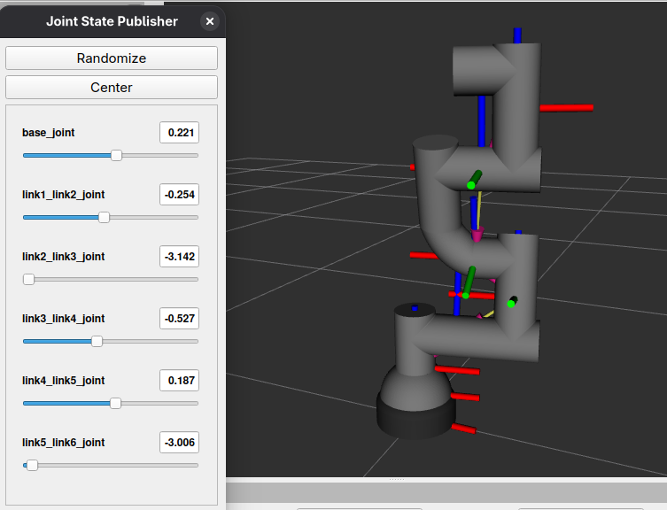

# 6-DOF Robotic Arm Description

ROS 2 description package for a custom 6-DOF serial robotic manipulator.

This package provides the robot model, meshes, inertial properties, RViz configuration, and launch files required for visualization and further integration with `ros2_control`, MoveIt 2, and Gazebo.

---

## Features

- 6-DOF serial manipulator
- URDF robot model
- STL visual meshes
- Link inertial properties
- Collision geometry
- RViz visualization
- Joint State Publisher GUI support
- Robot State Publisher integration

---

## Robot Specifications

| Property | Value |
|----------|--------|
| Robot Type | Serial Manipulator |
| Degrees of Freedom | 6 |
| Base | Fixed |
| Joint Types | 6 Revolute |
| Description Format | URDF |
| Mesh Format | STL |
| Units | SI (meters, kilograms, radians) |

---

## Link Structure

| Link |
|------|
| base |
| base_link |
| link_1 |
| link_2 |
| link_3 |
| link_4 |
| link_5 |
| link_6 |

---

## Joint Structure

| Joint | Type | Axis |
|--------|------|------|
| base_joint | Revolute | Z |
| base_link1_joint | Fixed | — |
| link1_link2_joint | Revolute | X |
| link2_link3_joint | Revolute | Z |
| link3_link4_joint | Revolute | X |
| link4_link5_joint | Revolute | X |
| link5_link6_joint | Revolute | Z |

---

## Package Structure

```text
arm_description/
├── launch/
│   └── display.launch.py
├── meshes/
│   ├── Base.stl
│   ├── Base_Joint.stl
│   ├── JOINT1.stl
│   ├── JOINT2.stl
│   ├── JOINT3.stl
│   ├── JOINT4.stl
│   ├── JOINT5.stl
│   └── JOINT6.stl
├── rviz/
│   └── display.rviz
├── urdf/
│   └── 6dof_arm.urdf
├── package.xml
├── setup.py
└── README.md
```

---

## Dependencies

- ROS 2
- robot_state_publisher
- joint_state_publisher_gui
- rviz2
- launch
- launch_ros
- ament_python

---

## Build

From the root of your ROS 2 workspace:

```bash
colcon build --symlink-install --packages-select arm_description
```

Source the workspace:

```bash
source install/setup.bash
```

---

## Launch

```bash
ros2 launch arm_description display.launch.py
```

This starts:

- Robot State Publisher
- Joint State Publisher GUI
- RViz2

---

## RViz

<p align="center">
    
</p>

---

## Coordinate System

- Units: meters
- Angles: radians
- Mass: kilograms
- Inertia: kg·m²

The robot description follows the standard ROS REP-103 coordinate conventions.

---

## Meshes

Visual meshes are provided as STL files.

Each mesh is exported from CAD using a common global reference frame and positioned within the URDF using the corresponding `<visual>` origin.

---

## Inertial Properties

Each link contains:

- Mass
- Center of Mass
- Inertia Tensor

The inertial properties were computed from the CAD geometry and converted to SI units for use in URDF.

---

## Collision Geometry

The package currently uses mesh-based collision geometry.

Primitive collision models are included as commented alternatives for future optimization.

<!-- 
## Future Work

- Xacro support
- ros2_control integration
- MoveIt 2 configuration
- Gazebo simulation
- Low-poly collision meshes
- Transmission definitions
- Hardware interface
- End-effector support
 -->
---

## License

Apache-2.0
